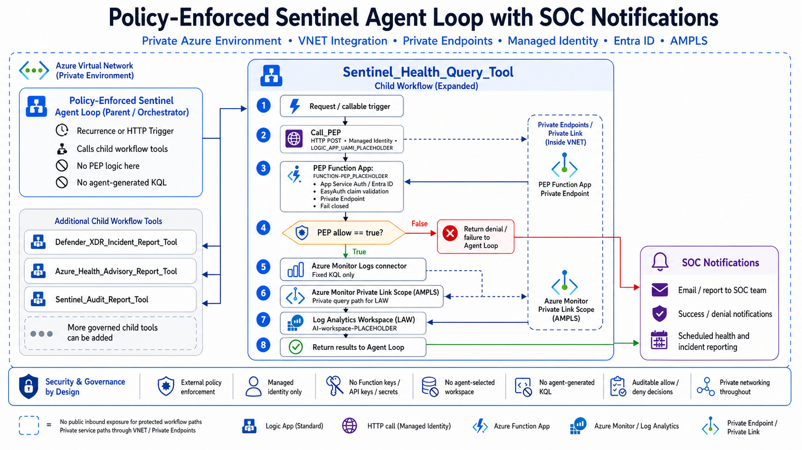

# Policy-Enforced Sentinel Agent Loop

A private-by-design reference pattern for governed Microsoft Sentinel automation using Azure Logic Apps Standard Agent Loop, a controlled child workflow tool boundary, an Azure Function-based Policy Enforcement Point (PEP), Entra ID / App Service Authentication, managed identity, RBAC, VNet integration, Private Endpoint access to the PEP, and private DNS.

The goal is not to build an unrestricted AI agent.

The goal is to prove a security control pattern:

```text
Agent Loop request
  → approved tool call
  → Logic Apps Standard child workflow boundary
  → Azure Function-based PEP
  → Entra ID-authenticated allow / deny decision
  → fixed approved Sentinel query only
  → return result or fail closed
```

This repository documents the control pattern. It is not a one-click production deployment package.

---

## Architecture

### Demo implementation


> **Network hardening note:** This demo uses a private endpoint for the Azure Function PEP and outbound VNet integration from Logic App Standard. The Log Analytics Workspace does not use Azure Monitor Private Link Scope (AMPLS) in the demo environment. For a stricter private-network deployment, see [Network Hardening and AMPLS Design Note](docs/network-hardening.md).

### Optional production hardening with AMPLS



The AMPLS diagram shows a stricter private-network deployment option where the Log Analytics Workspace / Sentinel query path is routed through Azure Monitor Private Link Scope.

---

## Status

Stage 1 reference implementation is complete for the Sentinel Health Query Tool.

Additional governed child workflow tools, including SOC notification and incident-oriented tools, should be added incrementally using the same policy-enforced child workflow pattern.

---

## Why this exists

Agentic SOC workflows are useful, but the model should not directly execute security actions.

This pattern treats agent output as untrusted for execution decisions:

- The agent cannot generate KQL.
- The agent cannot choose the workspace.
- The agent cannot choose a query ID.
- The agent cannot supply credentials, endpoints, tokens, or secrets.
- The agent cannot call Sentinel directly.
- The child workflow calls the PEP before any Sentinel action.
- The Sentinel query action exists only in the allow branch.
- Denied, malformed, failed, or unauthorized requests fail closed.

---

## Design principle

The model can reason.

The model can request.

But the model is not the security boundary.

Policy enforcement, identity validation, tool mediation, least privilege, network isolation, and auditability should live outside the model.

---

## Stage 1 reference implementation

This repository starts with one governed child workflow tool:

```text
Sentinel_Health_Query_Tool
```

This tool performs one fixed Sentinel health query through the Azure Monitor Logs connector after PEP approval.

Planned future governed tools:

- `Defender_XDR_Incident_Report_Tool`
- `Azure_Health_Advisory_Report_Tool`
- `Sentinel_Audit_Report_Tool`
- Additional SOC notification or reporting tools

Each tool should follow the same enforcement model.

---

## Governed execution path

The approved execution path is:

```text
Parent Agent Loop / orchestrator
→ controlled child workflow tool
→ Call_PEP action
→ Function App private endpoint
→ Azure Function PEP
→ EasyAuth / Entra ID claim validation
→ strict request-contract validation
→ explicit allow / deny decision
→ fixed approved Sentinel query only if allowed
→ success or denial response returned to Agent Loop
→ SOC notification path
```

---

## What was validated

The hardened reference flow validates that:

- The parent Agent Loop can call the controlled child workflow.
- The child workflow calls the PEP before Sentinel execution.
- The PEP Function App is protected by Entra ID / App Service Authentication.
- The Logic App calls the PEP using managed identity.
- EasyAuth restricts access to the expected client application, managed identity, and issuer tenant.
- The PEP code validates caller claims including `appid`, `tid`, and `aud`.
- The PEP enforces a strict request contract.
- Only a fixed, approved Sentinel health query can execute after an allow decision.
- Unexpected fields fail closed before Sentinel execution.
- The child workflow returns success or denial back to the Agent Loop.
- SOC notification paths can be used for success, denial, and reporting outcomes.

---

## Private-by-design model

This pattern assumes a private Azure environment.

Implemented in the demo:

- Logic App Standard public network access disabled.
- Logic App Standard outbound VNet integration.
- Azure Function PEP exposed through Private Endpoint.
- Private DNS resolution for the Function App private endpoint.
- Entra ID / App Service Authentication for the PEP.
- Managed identity authentication.
- Azure Monitor Logs connector execution using managed identity and RBAC.
- Strict Logic App-to-PEP request contract enforcement.

Optional production hardening:

- Azure Monitor Private Link Scope (AMPLS) for the Log Analytics Workspace / Sentinel query plane.
- Private access paths for SOC analysts through jump box, VPN, ExpressRoute, or approved SOC network routes.
- Public query access restriction only after private query access is validated.

See [Network Hardening and AMPLS Design Note](docs/network-hardening.md).

---

## Explicit non-goals

This repo does not claim to be:

- A one-click production deployment.
- A complete enterprise SOC platform.
- A replacement for Sentinel RBAC, Conditional Access, PIM, or governance.
- A claim that every Azure service path in the demo uses AMPLS.
- A claim that the model is trusted for execution decisions.

---

## Security controls

This pattern intentionally avoids:

- Function keys
- API keys
- Client secrets
- Shared secrets
- Log Analytics shared keys
- Agent-generated KQL
- Agent-selected workspaces
- Direct agent-to-Sentinel execution
- Public inbound exposure for the protected PEP path

The PEP validates the expected:

- Agent name
- Tool name
- Operation
- Workspace alias
- Query ID
- Caller managed identity
- Tenant
- Token audience
- Request contract

---

## Strict request contract

The child workflow sends a fixed request shape to the PEP.

Example sanitized request:

```json
{
  "agentName": "SECURITY_AGENT_NAME_PLACEHOLDER",
  "toolName": "Sentinel Health Query",
  "operation": "sentinel.health.query",
  "workspace": "WORKSPACE_ALIAS_PLACEHOLDER",
  "queryId": "sentinel_health_query_weekly_v1",
  "inputs": {},
  "logicAppRunId": "<logic-app-run-id>",
  "correlationId": "<correlation-id>"
}
```

The PEP should only allow approved fields such as:

```text
agentName
toolName
operation
workspace
queryId
inputs
logicAppRunId
correlationId
```

Unexpected fields should fail closed.

Example negative test field:

```json
"customQuery": "SecurityEvent | take 10"
```

Expected result:

```text
PEP allow = false
Reason = unexpected field detected
Sentinel query action = skipped
Denial response = returned to Agent Loop
Denial notification = sent
```

---

## Important authentication note

The Azure Function uses:

```python
func.AuthLevel.ANONYMOUS
```

This is intentional in this design.

Authentication is enforced by Azure App Service Authentication / EasyAuth at the platform layer. The function then validates EasyAuth caller claims in code and acts as the Policy Enforcement Point.

Before publishing or deploying, ensure the Function App Authentication provider is configured to:

- Require authentication.
- Return HTTP 401 for unauthenticated requests.
- Allow requests only from the expected issuer tenant.
- Allow requests only from the specific Logic App managed identity client application.
- Allow requests only from the expected managed identity object / principal ID.
- Use the expected token audience: `api://<pep-app-registration-client-id>`.

---

## Quick validation model

### Approved path

```text
Parent workflow trigger or approved orchestration path
→ Parent invokes governed child workflow/tool
→ Child workflow HTTP request received
→ Correlation ID initialized
→ PEP called
→ PEP response parsed
→ PEP allow condition true
→ Fixed Azure Monitor Logs query succeeded
→ Success response returned
→ SOC notification sent
```

Expected Function log proof:

```text
PEP decision: allow=True reason=PEP allow: fixed Sentinel health query is authorized decisionId=<guid>
Executed 'Functions.pep_evaluate' (Succeeded)
```

### Deny path

```text
Child workflow sends unexpected field
→ PEP detects contract expansion
→ PEP returns allow=false
→ Condition false branch runs
→ Sentinel query action is skipped
→ Denial response returned
→ Denial notification sent
```

Expected Function log proof:

```text
PEP decision: allow=False reason=unexpected field detected: ['customQuery'] decisionId=<guid>
Executed 'Functions.pep_evaluate' (Succeeded)
```

---

## Validation evidence

This reference pattern was validated in a private Azure environment using:

- A parent autonomous agent workflow calling a controlled child workflow tool.
- An Azure Function-based PEP protected by Entra ID / App Service Authentication.
- Managed identity authentication from Logic Apps to the PEP.
- Azure Monitor Logs connector execution using managed identity and RBAC.
- A fixed Sentinel Health Query executed only after PEP approval.
- A negative contract-expansion test using an unexpected field.
- Fail-closed behavior for denied, malformed, failed, or unauthorized paths.
- Log Analytics audit confirmation of AzureMonitorLogsConnector execution.

No Azure Portal screenshots or real environment identifiers are included in this repository.

Expected audit proof:

```kql
LAQueryLogs
| where TimeGenerated > ago(60m)
| where QueryText has "SecurityIncident"
| project TimeGenerated, AADObjectId, AADClientId, RequestClientApp, ResponseCode, QueryText
| order by TimeGenerated desc
```

Expected values:

```text
RequestClientApp = AzureMonitorLogsConnector
ResponseCode = 200
AADObjectId = managed identity used by the Azure Monitor Logs connector
```

---

## Repository contents

```text
.github/
  PULL_REQUEST_TEMPLATE.md

docs/
  architecture.md
  deployment-runbook.md
  identity-rbac-model.md
  networking-private-design.md
  network-hardening.md
  security-design.md
  threat-model.md
  sanitization-checklist.md
  images/
    policy-enforced-sentinel-agent-loop-demo.png
    policy-enforced-sentinel-agent-loop-ampls-private-link.png

diagrams/
  architecture.mmd
  sequence-flow.mmd
  fail-closed-flow.mmd

src/pep_function/
  function_app.py
  host.json
  local.settings.example.json
  requirements.txt

workflows/
  parent-agent-loop-sanitized.json
  child-sentinel-health-query-tool-sanitized.json

samples/
  pep-request-allow.json
  pep-response-allow.json
  pep-request-deny-unexpected-field.json
  pep-response-deny-unexpected-field.json
  audit-validation-query.kql

tools/
  sanitize_check.py

README.md
LICENSE
NOTICE.md
.gitignore
```

---

## Sanitization requirements

Before publishing, remove or replace:

- Tenant IDs
- Client IDs
- Managed identity IDs
- Object IDs
- Subscription IDs
- Resource group names
- Real workspace names
- Real Logic App names
- Real Function App names
- Callback URLs
- Email addresses
- Access tokens
- Secrets
- Screenshots containing identifiers

Use placeholders such as:

```text
TENANT_ID_PLACEHOLDER
PEP_APP_AUDIENCE_PLACEHOLDER
LOGIC_APP_UAMI_CLIENT_ID_PLACEHOLDER
WORKSPACE_ALIAS_PLACEHOLDER
FUNCTION-PEP_PLACEHOLDER
SECURITY_AGENT_NAME_PLACEHOLDER
```

## License

Apache License 2.0. See [LICENSE](LICENSE).
